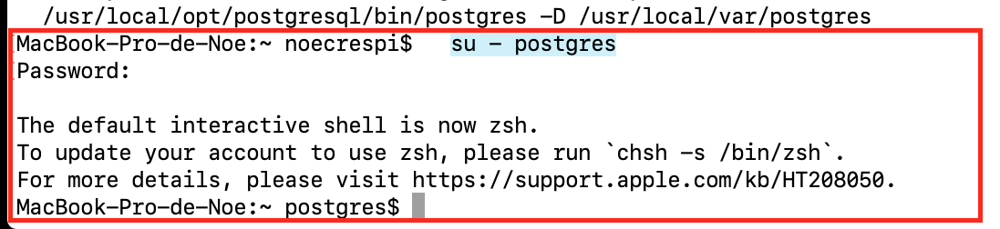
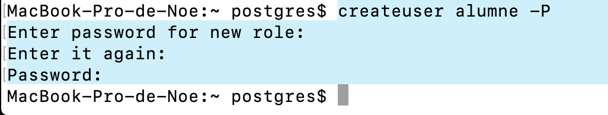
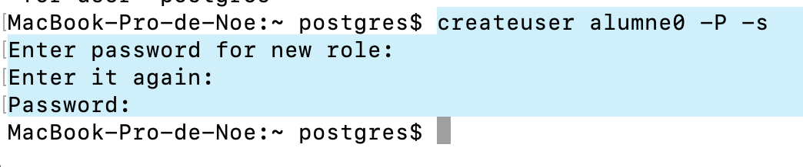
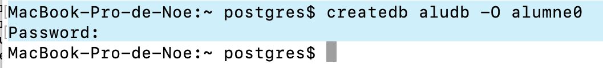
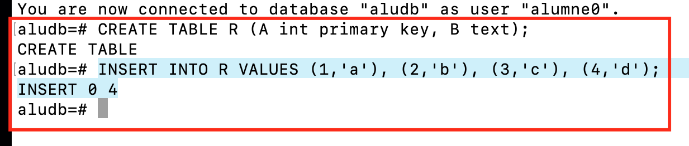
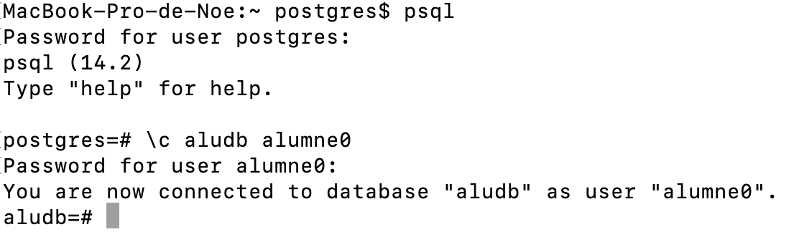

# PostgreSQL
## Noelia Crespí & Daniel Sobrino

### What's PostreSQL?

PostgreSQL is a flexible open-source object relational database management system able to cope in a huge variety of use cases, from single machines to data warehouses to web services with many concurrent users.

### Getting started

1. After installing postgresql in our machine, we start its service.
2. We initialize postgres with 
      ```
      su - postgres
      ``` 


### Activity 1.
#### Create a user named 'alumne' with password 'passalu' using `createuser`.

We use the following command and enter its password as requested:
```
createuser alumne -P
```


### Activity 2.
#### Create a user named 'alumne0' with password 'passalu' and make it superuser using `createuser`.

We use the following command and enter its password as requested:
```
createuser alumne0 -P -s
```


### Activity 3.
#### Create a database named 'aludb' with `createdb`. Make alumne0 the owner.

```
createdb aludb -O alumne0
```


### Activity 4.
#### Add the following table to aludb.
`
CREATE TABLE R (
  A int primary key,
  B text
);
INSERT INTO R VALUES (1,'a'), (2,'b'), (3,'c'), (4,'d');
`
1. Enter sql mode with:
```
psql
```

2. Connect to the database with alumne0:
```
\c aludb alumne0
```

3. Create the table and insert some contents:
```
CREATE TABLE R (A primary key, B text);
INSERT INTO R VALUES (1,'a'), (2,'b'), (3,'c'), (4,'d');
```

4. Exit sql mode with:
```
\q
```


### Activity 5.
#### Execute the following select with user alumne in aludb.
1. Enter sql mode with:
```
psql
```

2. Connect to the database with alumne:
```
\c aludb alumne
```

3. Do the select. As we can see, the user alumne doesn't have permision to perform SELECT on the table R:
```
SELECT * FROM R;
```


4. Exit sql mode with:
```
\q
```

### Activity 6.
#### Allow alumne to perform SELECT on the table.
1. Enter sql mode with:
```
psql
```
2. Connect to the database with alumne0:
```
\c aludb alumne0
```
3. Grant SELECT to alumne on the table R:
```
GRANT SELECT ON R TO alumne;
```

4. Exit sql mode with:
```
\q
```


### Activity 7.
#### Execute the following select with alumne:
```
SELECT * FROM R;
```
1. Enter sql mode with:
```
psql
```

2. Connect to the database with alumne:
```
\c aludb alumne
```


3. Do the select:
```
SELECT * FROM R;
```


4. Exit sql mode with:
```
\q
```


### Activity 8.
#### Delete the created database and users.

